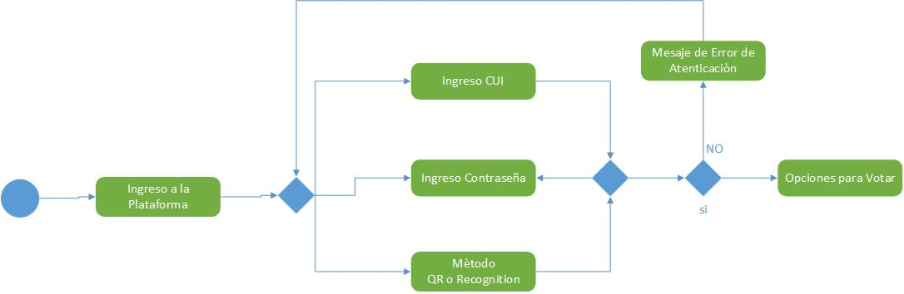
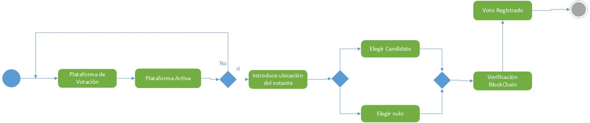
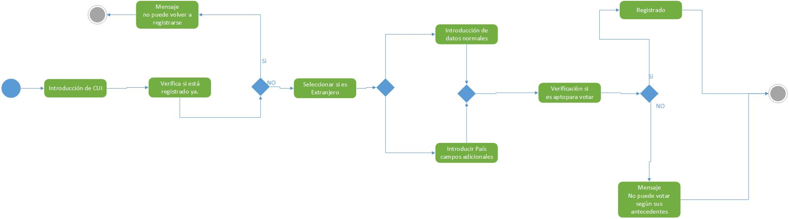

# Documentación de la fase 1 para el proyecto de laboratorio

##  Requerimientos Técnicos

### Frontend
Para la parte del Frontend se desarrollará con los lenguajes de javascript y python, utilizando 
los frameworks de Angular y Django. Las funciones se separan segun los diferentes microservicios
descritos más adelante.

### Backend
Para el Backend se utilzará los lenguajes de programación NodeJs con el framework de Express,
para el segundo legunaje se utilizará python con el framework de Flask.

### Base de Datos
En la base de datos se utilizará una de tipo relacional, por sus propiedades de ACID, 
ya que esta aplicación por su naturaleza necesita seguridad, y las base de datos relacionales 
suelen ser más seguras, además tiene opciones accesibles como mysql o postgresql, 
estas bases de datos son candidatas, y suelen comunicarse de manera fácil con 
los frameworks mencionados anteriormente.

### Aplicación Responsiva
 Para la parte de la aplicación responsiva, se hará utilziando la herramienta 
 de Boostrap, y al mismo tiempo utilizar sus propiedades para un mejor diseño 
 de la aplicación.

## Comunicación entre los servidores

Para la comunicación entre los servidores se piensa utilizar datos en formato Json
ya que es un estándard de comunicación entre lenguajes de comunicación. 
Dependiendo de la tecnología, se puede utilizar API REST, sin embargo,
dado que existe en python la librería requests, se puedencomunicar via http. 
(esto se describirá más a detalle en los siguientes puntos).

## Diagrama de Autenticación

## Diagrama de Votación

## Diagrama de Registro de ciudadanos

## MicroServicios Identificados

### Creacion de Elecciones (Backend)
    Este microservicio se implementará para hacer la creación de las elecciones y 
    los candidatos asignados a dicha
    elección esto es muy importante, tratar de separar este servicio que tenga 
    que ver exclusivamente con las elecciones, todo lo previo antes de votar.

### Creacion de Elecciones (Front)
    Este microservicio se implementará para la parte gráfica de ingreso y 
    creación de las elecciones, ingreso de los candidatos, y asignación de los candidatos 
    a las elecciones correspondientes.

### Renap (consulta de información) (Backend)
    Este microservicio ayudará a recolectar la información de los ciudadanos,
    solo estará para la lectura de la información y saber si el ciudadano puede votar o no
    es basicamente para el lado del backend, la lectura podrá realziarse por medio de su front
    el cual será otro micro servicio.

### Renap (consulta de información) (Frontend)
    En este microservicio se mostrará los datos consultados en el backend de Renap
    esto con el fin de ser mayor atractivo. También por su manejo sencillo se hará desde acá
    la carga de datos por parte de los entes encargados o los administradores.

### Registro de Usuarios y Votos (Backend)
    Este microservicio se implementará, para realizar el registro d eusuario con sus 
    campos corresopndientes, (nombre, cui, telefono, foto pin, tipo, país, etc.) 
    al mismo tiempo por la cantidad de integrantes en el equipo se pensará realizar el registro de usuarios
    y las funciones de votación en el mismo servicio. Aqui irá la elección  de candidato durante el voto, 
    la seguridad correspondiente al voto el método de seguridad 2FA y la tecnología blockchain.

### Registro de Usuarios y Votos (Frontend)
    Este microservicio se implementará, para realizar el registro d eusuario con sus campos corresopndientes, 
    (nombre, cui, telefono, foto pin, tipo, país, etc.) al mismo tiempo por la cantidad de integrantes 
    en el equipo se pensará realizar el registro de usuarios y las funciones de votación en el mismo servicio. 
    Aqui irá la elección  de candidato durante el voto, la seguridad correspondiente al voto
    el método de seguridad 2FA y la tecnología blockchain.

### Dashboard de Graficas (Backend)
    Se harán los calculos correspondientes según se requiera para el conteo de votos
    porcentajes, votos por localidad, etc.

### Registro de Usuarios y Votos (Frontend)
    Este microservicio se implementará conectandolo con el servidor de dashboard y pintar por medio
    de gráficas estadísticas.

### Creacion de microservicio Base de Datos
    Este microservicio de la base de datos también se realizará, esta base de datos se construirá con una base de datos mysql
    se eligió mysql por su adaptabilidad a los frameworks de para python y nodejs, también está la opción de utilizar
    postgreSql, sin embargo por el tipo de aplicación en la que se requiere seguridad se analiza implementar una base de datos
    relacional por sus propiedades de ACID.

## Descripción de la seguridad de la aplicación.

La seguridad de la aplicación primero que nada inicia con la implementación de una base de datos relacional, 
de manera que sean durables entre otras. En la parte de la autenticación se le sumará un 2FA, para agregarle 
seguridad en el momento de la votación.
En este caso se piensa agregar un código QR temporal, osea utilizar un 2FA TOTP. En la parte del registro 
se buscará si es apto para votar o si su expediente no deja que vote. Luego de eso en la parte del envío 
de la data se utilizará JWT para encriptar la cadena con llaves y poder modificar que el token sea temporal. 
Y por último agregar la tecnología BlockChain al final del voto para serciorase que
el voto sea aceptado por las entidades más importantes, quienes su trabajo es auditar la transparencia.

## Descripción del uso de la tecnología blockchain.
Como se mencionaba anteriormente la tecnología blockchain nos ayudará a poder utilizar a las entidades que se encargan de la transparencia
a funcionar como nodos y que en el momento de cada voto se pueda sercioarar que el voto sea válido y no se haya cometido algún fraude
y quede registrado sin que esos datos puedan editarse.

## Documentación de las Pipelines para los servicios.
Para el caso de los pipelines se utilizarán los que comunmente se trabajan, para garantizar que el softwre cumpla con lo requerido para 
poder ser desplegado, cada una de los microservicios serán testeados para saber si cada una de sus funcionalidades están correctas
luego se procede a construir las imágenes y por último de desplegarlas, teniendo en consideración que por cada microservicio que falle
podrá funcionar la demás aplicación sin que los demás microservicios sean afectados y funcionar correctamente.

## PBI's de los Integrantes del equipo

### Creacion de Elecciones (Backend) 
|Integrante| Tarea |
|------ |----|
| **Integrante 1** | Creación de todo lo relacionado con las funcionalidades de la creación de elecciones, endpoints correspondientes para almacenar las elecciones corresondientes  |
| **Integrante 1** | Maneja la zona horaria por país, las conversiones necesarias para guardar el horario de inicio y cierre |
| **Integrante 1** | Agregar los candidatos necesarios con la metadata Correspondiente |
| **Integrante 1** | Encargado de los endpoits de obtener la información de las elecciones realizadas cuando se necesite |
| **Integrante 1** | Encargado de realizar el login, seguridad de los administradores de los grupos y sus respectivas credenciales |
| **Integrante 1** | También si es necesario agregar a la creación, editar y eliminar información |

### Creacion de Elecciones (Front) 
|Integrante| Tarea |
|------ |----|
| **Integrante 1** | Creación de todo lo relacionado con las funcionalidades de las elecciones, desde el punto de vista visual
se dejará al mismo integrante para que pueda trabajar de una manera independiente las funciones del back y del front
diseño responsive, intuitivo, etc.

### Renap (Backend) 
|Integrante| Tarea |
|------ |----|
| **Integrante 1** | Creación de todo lo relacionado con las funcionalidades de la creación de elecciones, endpoints correspondientes para almacenar las elecciones corresondientes  |
| **Integrante 1** | Maneja la zona horaria por país, las conversiones necesarias para guardar el horario de inicio y cierre |
| **Integrante 1** | Agregar los candidatos necesarios con la metadata Correspondiente |
| **Integrante 1** | Encargado de los endpoits de obtener la información de las elecciones realizadas cuando se necesite |
| **Integrante 1** | Encargado de realizar el login, seguridad de los administradores de los grupos y sus respectivas credenciales |
| **Integrante 1** | También si es necesario agregar a la creación, editar y eliminar información |
| **Integrante 1** | Cerrar las elecciones automaticamente según horario |
| **Integrante 1** | Activar las elecciones automaticamente según horario |

### Renap (Back) 
|Integrante| Tarea |
|------ |----|
| **Integrante 2** | Se encargará de la consulta de la información que se solicite departe del micro servicio de votación para saber si el usuario es apto para votar o no.|
| **Integrante 2** | También se encargará de la carga de datos masiva de la información de los usuarios y su expediente.|

### Renap (Front) 
|Integrante| Tarea |
|------ |----|
| **Integrante 2** | Creación de todo lo relacionado con las funcionalidades de Renap, desde el punto de vista visual se dejará al mismo integrante para que pueda trabajar de una manera independiente las funciones del back y del front diseño responsive, intuitivo, etc.|

### Registro de Usuarios y Votos (Backend)
|Integrante| Tarea |
|------ |----|
| **Integrante 3** | Registro de las personas que quieran ir a votar, recepción de datos.|
| **Integrante 3** | Validación de los campos correctos y envio de ifnormacion a renap.|
| **Integrante 3** | Validar si la persona es extranjera o no para requerir más campos |
| **Integrante 3** | Solicitar datos correspondientes al momento de votar |
| **Integrante 3** | apartado de Login |
| **Integrante 3** | requerir token de QR temporal por 30seg |
| **Integrante 3** | Analisis facial de la persona por mediod de AWS recognition|
| **Integrante 3** | validar que las elecciones estén disponibles |
| **Integrante 3** | Enviar mensajes si no puede realizar el voto |
| **Integrante 3** | Verificación Blockchain para validar voto|
| **Integrante 3** | Introducción de campo de ubicación por GPS|
| **Integrante 3** | Sección de Carga de datos|

### Registro de Usuarios y Votos (Front) 
|Integrante| Tarea |
|------ |----|
| **Integrante 3** | Creación de todo lo relacionado con las funcionalidades de Registro de votación, 
y de lo relacionado a la votación, desde el punto de vista visual se dejará al mismo integrante 
para que pueda trabajar de una manera independiente las funciones del back y del front diseño responsive, intuitivo, etc.|

### DashBoard (Backend)
|Integrante| Tarea |
|------ |----|
| **Integrante 4** | Calculos correspondientes solicitados para las gráficas en tiempo real .|
| **Integrante 4** | Conteo por Región.|
| **Integrante 4** | Configuración de Grafana |

### DashBoard (Frontend)
|Integrante| Tarea |
|------ |----|
| **Integrante 4** | Obtencio de datos para graficar .|
| **Integrante 4** | Obtener datos para reportes|
| **Integrante 4** |Mostrar datos en Grafana.|

### Base de datos, ER, Script, Creación (Frontend)
|Integrante| Tarea |
|------ |----|
| **Integrante 4** | Creación de modelo Relacional|
| **Integrante 4** | Script de la base de datos|
| **Integrante 4** |Creación de Microservicio de la base de datos|

### Arquitectura del proyecto
|Integrante| Tarea |
|------ |----|
| **Integrante 2** |Uso de Pipelines, Gitlab y Orquestador|
| **Integrante 2** |Despliegue de la aplicación|

### Redes
Los micro servicios se conectarán bajo una red privada, interna para que no tenga problemas
de comunicación entre microservicios, se publicará el dominio y para conectar con los demás dominios
por medio de la ip Pública para tener acceso al exterior

### Arquitectura del proyecto
|Integrante| Tarea |
|------ |----|
| **Integrante 2** |Uso de Pipelines, Gitlab y Orquestador|
| **Integrante 2** |Despliegue de la aplicación|

## Contratos
### Elecciones
|Tipo| Endpoint | Data
|------ |----|------|
| POST | "api/guardar/elecciones" | {titulo:"",descr:"",fechaIni:"dd-mm-YY",fechaFin:"",Ubicaion:""}|
| POST |"api/guardar/candidato"| {partido:"",imagen:"",nombre:"","puesto":"lugar",id_elecciones:id}|
| GET | "api/obtener/elecciones" |[{titulo:"",descr:"",fechaIni:"dd-mm-YY",fechaFin:"",Ubicaion:""}]|
| GET |"api/obtener/candidatos" | [{partido:"",imagen:"",nombre:"","puesto":"lugar",id_elecciones:id}]|
| GET | "api/obtener/elecciones/id" |{titulo:"",descr:"",fechaIni:"dd-mm-YY",fechaFin:"",Ubicaion:""}|
| GET |"api/obtener/candidatos/id" | {partido:"",imagen:"",nombre:"","puesto":"lugar",id_elecciones:id}|

### Ciudadanos
|Tipo| Endpoint | Data
|------ |----|------|
| POST | "api/guardar/ciudadano" | {nombre:"",cui:00,tel:00,foto:"",pin:"",dep:"",mun:"",tipo:"extranjero",pais:"",estado:""}|
| GET |"api/obtener/ciudadano:id"| {nombre:"",cui:00,tel:00,foto:"",pin:"",dep:"",mun:"",tipo:"nacional",pais:"",estado:""}|
| POST | "api/verificar/ciudadano/apto" |{cui:00}|
| GET |"api/obtener/apto"       | {estado:"aceptado/rechazado"}|
| GET | "api/obtener/ciudadanos/_pais" |[{nombre:"",cui:00,tel:00,foto:"",pin:"",dep:"",mun:"",tipo:"nacional",pais:"",estado:""}]|

### Votacion
|Tipo| Endpoint | Data
|------ |----|------|
| POST | "api/login/" | {cui:00,pin:"",token/porcentaje:00}|
| GET |"api/obtener/opciones/presidente"| {nombre:"",cui:00,tel:00,foto:"",pin:"",dep:"",mun:"",tipo:"nacional",pais:"",estado:""}|
| GET | "api/verificar/vicepresiente" |{cui:00}|
| POST | "api/votacion/ciudadano" | {id_ciudadano:00,id_candidato::00,voto:1}|

### Monitoreo
|Tipo| Endpoint | Data
|------ |----|------|
| GET | "api/votos/id_candidato" | {nombre:"",foto:00,total:00}|
| GET | "api/votos/porcentaje/id_candidato" | {nombre:"",foto:00,porcentaje:00}|
| GET |"api/votos/id_ubicacion"| [{nombre:"",total:00,foto:"",ubicacion:""}]|
|GET  |"api/votos/porcentaje/id_ubicacion"| [{nombre:"",porcentaje:00,foto:"",ubicacion:""}]|
| GET | "api/votos/puesto" |[{nombre:"",total:00,foto:"",puesto:""}]|
| GET | "api/votos/porcentaje/puesto" |[{nombre:"",porcentaje:00,foto:"",puesto:""}]|
| GET |"api/votos/partidos"  | [{partido:"",total:00,foto:""}]|
| GET |"api/votos/porcentaje/partidos"  | [{partido:"",porcentaje:00,foto:""}]|

### Auditoria
|Tipo| Endpoint | Data
|------ |----|------|
| GET | "api/votacion/auditoria/" | {cui:00,voto:"",fecha:"dd-mm-YY",Hora:"",Localidad:""}|

